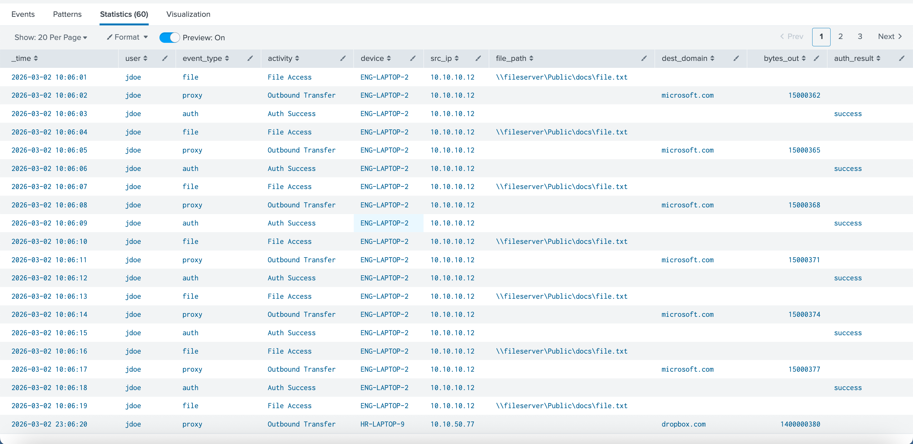

# Behavioral Analytics & UEBA Lab

## Goal
Correlate identity, access, and system events into a user-centric view to detect insider-style activity and classify findings for further investigation.

## Data sources
- Authentication activity (success/failure)
- File access events (including “sensitive” paths)
- Network/proxy activity (outbound destinations + bytes out)
- Device context (host/source IP)
- Simulated/sanitized data

## Analytics logic
This lab models UEBA by building a per-user timeline and flagging deviations from typical behavior. Confidence increases when multiple signals chain together in the same time window, such as:
- Auth anomalies (failure bursts, unusual timing)
- New device / new source IP for the user
- Sensitive file access (e.g., HR/finance-style paths)
- Outbound transfer anomalies (baseline vs spike)

## Scoring
Risk is prioritized using a simple numeric score:
- Data movement anomaly: +40  
- Sensitive file access: +30  
- New device context: +25  
- After-hours activity: +15  
- Auth failure burst: +10  
- Thresholds: 50+ = triage, 80+ = escalate for deeper investigation

## SPL files
- `spl/ueba-correlation-candidates.spl`
- `spl/ueba-limited-inquiry-timeline.spl`

## Evidence (screenshots)
**UEBA Correlation Candidates**

**Limited Inquiry Timeline (User-centric)**

## What does this Lab do?
This lab correlates auth, file access, device context, and outbound transfer signals into a user-centric view. I baseline activity, flag deviations, and prioritize investigation when multiple indicators chain together in the same window.
